# SOC Triage Lab

SOC Triage Lab is a reproducible, public-data project for measuring whether a machine-learning (ML) triage layer can reduce the number of security alerts that analysts need to review without missing true positives. It explores detection engineering, alert prioritization, and response automation while keeping the work independent of confidential workplace systems.

> Built entirely with public datasets and documentation. No proprietary code, configuration, data, or architecture is used.

## Research question

How much can an ML triage layer reduce the alert volume requiring analyst review before it begins to miss true-positive alerts, when measured against public ATT&CK telemetry?

The project treats this as an empirical question. Results should include a severity-based baseline, temporal evaluation, per-technique failure analysis, and limitations. Technology choices are added incrementally and kept only when they meet a stated need or demonstrate a measured learning outcome.

## Data and labeling

- **Attack telemetry:** [OTRF Security-Datasets](https://github.com/OTRF/Security-Datasets), with documented ATT&CK techniques, hosts, and time ranges used as labeling context.
- **Benign telemetry:** normal activity from the same collection where available; [Loghub](https://github.com/logpai/loghub) is a possible additional source when suitable.
- Alerts during a documented attack window on the target host are labeled true positive only when the detection's ATT&CK technique matches the documented technique. Alerts in benign data are false positives. Alerts during an attack window with an unrelated technique are reported separately.
- Avoid label leakage: detection-rule identity must not be used as a model feature when that rule identity determines the label.

## Evaluation approach

Compare three alert-ranking approaches on the same time-based split:

1. Rule-severity ranking as a simple baseline.
2. Calibrated logistic regression for an interpretable model.
3. LightGBM as a tree-based model.

Prioritize precision at a realistic analyst capacity, recall at a fixed alert-review budget, recall by ATT&CK technique, and calibration. Analyze failures by technique and report when the severity baseline performs better. Accuracy and AUC alone can hide poor performance on highly imbalanced alert data.

Candidate contextual features include process-pair rarity, command-line entropy and length, executable-path prevalence, one-hour host alert count, technique diversity, event hour, off-hours status, and rule severity. Compute learned statistics using training data and only use context available at the alert's evaluation time.

## Conceptual workflow

```mermaid
flowchart LR
    A[Public attack and benign telemetry] --> B[Collect, parse, normalize]
    B --> C[Store events with source evidence]
    C --> D[Evaluate documented detections]
    D --> E[Alert labeling]
    E --> F[Context features]
    F --> G[Severity, logistic regression, LightGBM]
    G --> H[Time-based evaluation]
    H --> I[Threshold and routing policy]
    I --> J[Auto-close, analyst review, or escalation]
```

The diagram describes the intended flow; individual stages and service components are exploratory until implemented and measured.

## Technology, added in stages

- **Local batch foundation:** Python, pandas, DuckDB, Parquet, scikit-learn, LightGBM, CLI/Make, and persistent JSON run records.
- **Local investigation summaries:** optionally add Ollama with exact-match DuckDB evidence retrieval, structured outputs, and claim-to-evidence checks.
- **Graph context:** optionally add explicit event relationships and persistent provenance, comparing retrieval against the same SQL baseline.
- **Search and dashboards:** when justified, explore OpenSearch/Dashboards, Vector, Sigma CLI/pySigma, FastAPI, GX Core, Prometheus, Grafana, and Docker Compose.
- **Separate advanced experiments:** Airflow, Redpanda or Kafka, PySpark, OpenTelemetry/Tempo, and TheHive are optional and should be justified by measured needs or explicit learning goals.

Begin with the smallest local workflow. Preserve raw evidence, stable event and evidence identifiers, event time, source location, dataset/rule/model versions, and run summaries so results can be reproduced and audited.

## Data and process observability

Start with local validation, structured JSON logs, and persistent run summaries. Validate record counts and required fields, timestamps, unique identifiers, graph endpoints, evidence references, retrieval time bounds, and structured model output. Report accepted and rejected records together. Connect stage logs and validation outcomes through `run_id`, `alert_id`, and `evidence_id`; add service metrics and tracing only as the architecture grows.

## Scope and current status

The project documents a proposed implementation and evaluation plan. This repository currently contains the project specification and exploration plans; it does not yet include an implemented pipeline or measured model results. Do not interpret proposed tools or target metrics as completed work.

## License

MIT License. See [LICENSE](LICENSE) when the license file is added.
