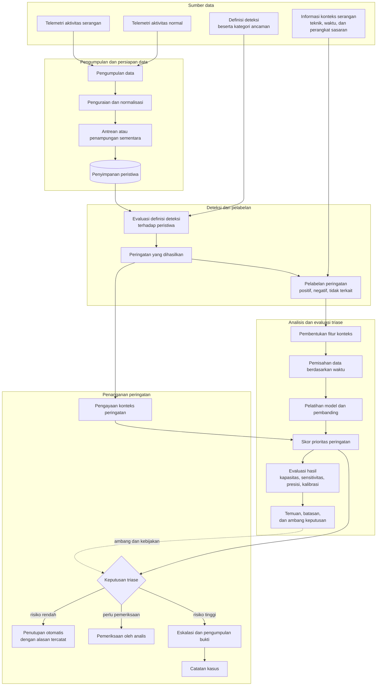
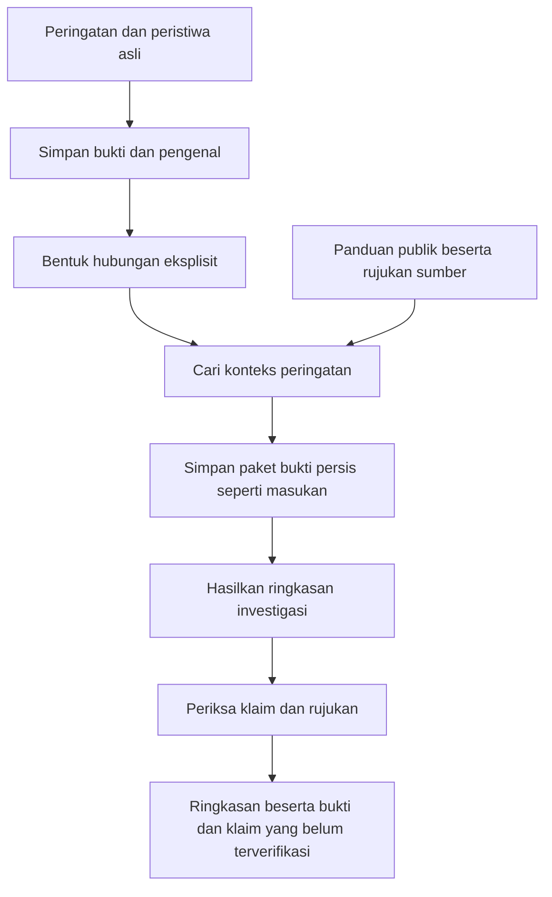

# soc-triage-lab - spesifikasi pembangunan

**Tujuan:** membangun proyek portofolio publik yang dapat direproduksi untuk menunjukkan rekayasa pusat operasi keamanan (SOC) berbasis AI, meliputi triase dengan pembelajaran mesin (ML), otomatisasi respons (SOAR), dan aturan deteksi, dengan tetap mematuhi perjanjian kerahasiaan (NDA).

**Alokasi waktu:** 6 hari kerja dalam 2-3 akhir pekan.

**Prinsip pengembangan independen:** setiap keputusan rancangan dalam repositori ini harus dapat ditelusuri ke sumber publik, seperti SigmaHQ, MITRE ATT&CK, NIST SP 800-61r2, dokumentasi OpenSearch/Elastic, makalah, atau README kumpulan data. Jika suatu keputusan hanya dapat dijelaskan dengan pengetahuan dari tempat kerja, hapus keputusan tersebut atau cari dasar publiknya.

---

## 0. Persiapan awal (30 menit, kerjakan terlebih dahulu)

- [ ] Gunakan akun GitHub pribadi. Tetapkan identitas Git repositori secara eksplisit:
      `git config user.email "<alamat surel pribadi>"`. Penggunaan alamat surel perusahaan akan tercatat dalam metadata komit.
- [ ] Gunakan lisensi MIT dan cantumkan pernyataan berikut dalam README: *"Dibangun sepenuhnya menggunakan kumpulan data dan dokumentasi publik. Tidak menggunakan kode, konfigurasi, data, atau arsitektur milik pihak lain yang bersifat tertutup."*

---

## 1. Pertanyaan utama proyek

Bangun proyek yang **mengajukan pertanyaan dan menjawabnya dengan hasil pengukuran**:

> Seberapa besar volume peringatan yang perlu diperiksa analis dapat dikurangi oleh lapisan triase ML sebelum mulai melewatkan peringatan positif benar, berdasarkan pengukuran pada telemetri ATT&CK publik?

Nilai pembeda proyek ini terletak pada pertanyaan yang dapat diuji, hasil yang dapat diukur, dan penjelasan tentang keterbatasan metode. Ketiganya menunjukkan kemampuan rekayasa yang melampaui demonstrasi kumpulan alat.

Seluruh komponen berikut mendukung pengukuran tersebut secara jujur.

---

## 2. Pilihan teknologi

Mulai dari Tahap 1 dan tambahkan satu kemampuan pada setiap langkah. Tahapan ini merupakan pilihan eksplorasi; tahap yang sudah berfungsi dapat menjadi cakupan akhir proyek.

| Tahap | Pilihan teknologi | Hal yang dipelajari | Syarat untuk melanjutkan |
|---|---|---|---|
| 1. Pemrosesan kelompok data secara lokal | Python/pandas, DuckDB + Parquet, scikit-learn + LightGBM, CLI/Make, catatan eksekusi JSON | SQL, logika deteksi, evaluasi berdasarkan waktu, dan pemeriksaan data dasar | Alur inti dan pengenal bukti berfungsi; ringkasan investigasi otomatis dibutuhkan. |
| 2. Model bahasa besar (LLM) lokal | Tahap 1 + Ollama dengan model lokal; pencarian konteks berdasarkan kecocokan tepat melalui SQL | Ringkasan dengan rujukan bukti, informasi yang belum tersedia, serta masukan dan keluaran tersimpan | Pencarian sederhana melewatkan hubungan yang berguna dalam kasus uji yang disiapkan. |
| 3. Konteks berbasis graf | Tahap 2 + Semantica dengan hubungan eksplisit dan catatan asal-usul data yang disimpan secara persisten | Perbandingan pencarian berbasis graf dengan pencarian SQL yang sama | Graf meningkatkan hasil pencarian yang terukur, atau akses melalui layanan dibutuhkan. |
| 4. Layanan pencarian | OpenSearch + Dashboards, Vector, Sigma CLI/pySigma, FastAPI, Docker Compose; GX Core + Prometheus + Grafana | Pencarian, integrasi layanan, kualitas data, dan pemantauan proses | Beban kerja atau kebutuhan operasional yang terukur mendukung penambahan komponen. |
| 5. Eksperimen lanjutan | Pilih secara terpisah: Airflow; Redpanda atau Kafka; PySpark; OpenTelemetry + Tempo; TheHive | Penjadwalan, pemrosesan ulang, kelompok data yang lebih besar, penelusuran, atau alur kasus | Pertahankan komponen yang memiliki manfaat terbukti atau tujuan pembelajaran eksplisit. |

Gunakan [rencana eksplorasi teknologi](docs/stack-exploration-plan.md) untuk melihat hasil yang diharapkan, alternatif, biaya, dan kriteria penerimaan setiap tahap. Pertahankan pembanding berdasarkan tingkat keparahan, pembagian berdasarkan waktu, jejak bukti, dan analisis kegagalan pada setiap tahap yang relevan.

### Pendekatan bertahap dan evaluasi kompleksitas

Nilai kebutuhan sebelum menambahkan komponen, lalu ukur biaya aktual selama implementasi. Risiko kompleksitas yang berlebihan dapat dikenali sebelum proyek selesai; pengukuran selama pengerjaan memberikan biaya aktual, seperti waktu pemasangan dan penggunaan sumber daya.

1. **Bangun alur inti:** pengumpulan, pencarian, deteksi, pelabelan, pembentukan fitur, evaluasi, dan penyaluran peringatan menggunakan perangkat inti serta skrip Python. Simpan hasil antara sebagai JSON/Parquet agar tahap berikutnya mudah dibandingkan.
2. **Catat kondisi pembanding:** waktu pemrosesan setiap tahap, ukuran data, penggunaan CPU/RAM/penyimpanan, jumlah langkah manual, serta penanganan kegagalan dan pengulangan proses.
3. **Uji satu kandidat pada setiap langkah:** bandingkan pemrosesan lokal dengan PySpark menggunakan masukan dan keluaran yang sama; coba Airflow ketika penjadwalan, ketergantungan tugas, percobaan ulang, atau observabilitas tugas dibutuhkan.
4. **Putuskan berdasarkan bukti:** pertahankan kandidat jika memenuhi kebutuhan yang teridentifikasi atau memberikan bukti kemampuan portofolio yang jelas, dengan biaya implementasi dan operasi yang dicatat. Jika tidak, dokumentasikan hasil pengujian dan gunakan pilihan pembanding yang lebih sederhana.

Catat manfaat yang diharapkan, waktu penyiapan dan penelusuran kesalahan, penggunaan sumber daya saat tidak aktif dan saat memproses, durasi pemrosesan, serta beban konfigurasi dan pemeliharaan setiap komponen. Pada data berukuran kecil, peningkatan kecepatan yang sedikit belum cukup untuk membenarkan penambahan Spark; pertimbangkan juga tujuan pembelajaran pemrosesan terdistribusi dan jelaskan pertimbangan manfaat serta biayanya dalam README.

### Gambaran besar alur data

Diagram ini menjelaskan aliran data dan keputusan secara konseptual. Pilihan teknologi ditentukan setelah kebutuhan setiap tahap dipahami.

**Cara membaca:** telemetri dikumpulkan, dinormalisasi, dan disimpan, kemudian definisi deteksi menghasilkan peringatan yang diberi label berdasarkan konteks terdokumentasi. Fitur dan model menghasilkan skor prioritas, sedangkan hasil evaluasi menentukan ambang serta kebijakan penyaluran peringatan. Peringatan kemudian ditutup, diperiksa analis, atau dieskalasikan.

---

## 3. Data dan label

Tetapkan sumber data dan definisi label sebelum menulis kode.

**Telemetri serangan:** [OTRF Security-Datasets](https://github.com/OTRF/Security-Datasets) menyediakan rekaman telemetri Windows/Sysmon/Zeek beserta dokumentasi teknik ATT&CK yang dijalankan dan rentang waktunya. **Teknik dan rentang waktu terdokumentasi menjadi acuan pelabelan.** Pendekatan ini mengurangi kebutuhan pelabelan manual selama pengerjaan proyek.

**Data aktivitas normal:** gunakan rekaman operasi normal dari koleksi yang sama, dengan [Loghub](https://github.com/logpai/loghub) sebagai tambahan volume bila sesuai. Data normal yang benar-benar mewakili aktivitas tanpa serangan diperlukan agar distribusi kelas dan metrik dapat ditafsirkan dengan tepat.

**Definisi label** (cantumkan definisi ini secara utuh dalam `RESULTS.md`):

- Peringatan muncul dalam rentang waktu serangan terdokumentasi, pada perangkat sasaran, dan tag ATT&CK aturan Sigma cocok dengan teknik yang tercatat dijalankan: **positif benar (TP)**.
- Peringatan muncul pada data aktivitas normal: **positif palsu (FP)**.
- Peringatan muncul dalam rentang waktu serangan tetapi memiliki tag teknik yang tidak terkait: **beri kategori terpisah** dan laporkan jumlahnya; jangan langsung menganggapnya sebagai TP.

**Risiko kebocoran label:** hindari pelatihan dengan fitur yang berasal dari identitas aturan Sigma yang juga menentukan label. Jika `rule_id` menjadi sumber label sekaligus fitur, model dapat mempelajari label itu sendiri. Fitur harus menggambarkan konteks peringatan.

---

## 4. Rencana harian (acuan tahap layanan)

### Akhir pekan pertama

**Hari 1: menyiapkan alur pemrosesan**

- `docker-compose.yml`: OpenSearch, Dashboards, dan Vector. Tambahkan antrean serta penjadwalan ketika dibutuhkan; gunakan rencana eksplorasi untuk tahap lokal yang lebih sederhana.
- Alur Vector: membaca JSON Security-Datasets, menormalisasi ke ECS, lalu menulis ke indeks OpenSearch `logs-*`.
- Kriteria selesai: peristiwa mentah dapat dicari melalui Dashboards dan jumlah rekamannya sesuai dengan berkas sumber.

**Hari 2: aturan deteksi**

- Ambil 25-40 aturan SigmaHQ yang mencakup pembuatan proses, persistensi, akses kredensial, dan pergerakan lateral. Konversikan dengan `sigma-cli` menjadi kueri OpenSearch.
- Jalankan aturan secara terjadwal melalui skrip, lalu tulis kecocokan ke `alerts-*` dengan `rule_id`, `rule_severity`, `attack_technique`, `host`, `timestamp`, dan peristiwa sumber.
- Buat skrip pelabelan dari bagian 3 sebagai tahap terpisah yang menghasilkan `labels.parquet`.
- Kriteria selesai: tersedia beberapa ribu peringatan berlabel dan tabel distribusi kelas. Simpan tangkapan layar tabel untuk menjelaskan ketidakseimbangan kelas.

### Akhir pekan kedua

**Hari 3: pembentukan fitur**

Kelangkaan dan kemunculan bersama menjadi sumber informasi kontekstual. Mulai dengan Python/pandas dan simpan tabel fitur sebagai Parquet; gunakan PySpark untuk perbandingan terukur, sementara pelatihan model tetap menggunakan Python karena tabel peringatan berukuran kecil.

- `process_rarity`: frekuensi pasangan `(parent_image, image)` dalam korpus.
- `cmdline_entropy`: entropi baris perintah; sertakan juga panjang baris perintah.
- `path_prevalence`: frekuensi kemunculan jalur berkas program dalam korpus.
- `host_alert_count_1h`: jumlah peringatan pada perangkat yang sama dalam jendela waktu satu jam.
- `technique_diversity_1h`: jumlah teknik ATT&CK berbeda pada perangkat dalam jendela waktu tersebut.
- `hour_of_day`, `is_offhours`: jam kejadian dan penanda waktu di luar jam kerja.
- `rule_severity`: tingkat keparahan aturan, yang juga digunakan sebagai pembanding sederhana.

Analisis frekuensi dan pengelompokan kemunculan merupakan praktik dalam forensik digital dan respons insiden (DFIR); cantumkan rujukan publiknya dalam README sebagai dasar pemilihan fitur.

**Hari 4: model dan evaluasi yang dapat dipertanggungjawabkan**

Selalu bandingkan tiga pendekatan:

1. **Pembanding sederhana:** urutkan berdasarkan `rule_severity`. Laporkan jika hasilnya mengungguli model.
2. Regresi logistik yang dikalibrasi dan dapat ditafsirkan.
3. LightGBM.

Ketentuan evaluasi:

- **Pisahkan data berdasarkan waktu.** Pembagian acak pada data keamanan berurutan dapat membocorkan informasi masa depan ke data pelatihan dan menghasilkan pengukuran yang menyesatkan.
- Utamakan metrik yang mencerminkan kapasitas pemeriksaan dan serangan yang terlewat. Akurasi dan AUC tidak menjadi metrik utama pada kelas yang sangat tidak seimbang; rujuk pembahasan Axelsson dalam *The Base-Rate Fallacy and the Difficulty of Intrusion Detection* (1999/2000).
- Laporkan **precision@k**, dengan k sebagai kapasitas harian analis yang realistis; **sensitivitas (recall) terhadap positif benar pada batas jumlah peringatan yang tetap**; **sensitivitas per teknik**; serta **kurva kalibrasi**.
- Jelaskan kegagalan per teknik, misalnya penurunan sensitivitas pada injeksi proses T1055 jika fitur hubungan induk-anak proses tidak menangkap aktivitas tersebut.

Kriteria selesai: `RESULTS.md` memuat tabel, grafik, dan paragraf berjudul **Hal yang belum berhasil**.

### Akhir pekan ketiga

**Hari 5: otomatisasi respons (SOAR)**

Prosedur A, *Triase dan penyaluran peringatan*, menggunakan API triase Python:
peringatan baru -> pengayaan melalui VirusTotal tingkat gratis, MISP, atau pencarian prevalensi lokal -> skor model -> penyaluran.

- Skor di bawah ambang rendah: tutup otomatis dan catat alasannya.
- Skor menengah: masukkan ke antrean analis tingkat pertama (L1) beserta hasil pengayaan.
- Skor tinggi: lakukan eskalasi.

Prosedur B, *Paket eskalasi*, dapat dihapus lebih dahulu jika waktu terbatas:
peringatan dieskalasikan -> buka kasus -> lampirkan daftar pemeriksaan pengumpulan artefak perangkat -> tandai fase NIST SP 800-61 -> kirim pemberitahuan.

Ambang penutupan otomatis diturunkan dari kurva presisi pada hari keempat. Dokumentasikan hubungan tersebut agar evaluasi ML dan tindakan SOAR menjadi satu alur yang dapat ditelusuri.

**Hari 6: dokumentasi**

Siapkan panduan operasional, panduan integrasi, dan logika prosedur yang dapat diikuti analis secara mandiri:

- `README.md`: pertanyaan utama, hasil, diagram arsitektur, dan panduan memulai.
- `RESULTS.md`: metodologi, metrik, analisis kegagalan, dan ancaman terhadap validitas hasil.
- `docs/runbooks/`: satu panduan operasional untuk setiap prosedur, ditujukan bagi analis L1.
- `docs/attack-coverage.md`: matriks ATT&CK yang menunjukkan cakupan dan keterbatasan aturan.
- `docs/integration-guide.md`: cara menambahkan sumber log baru.

---

## 5. Urutan pengurangan cakupan

Jika pengerjaan tertinggal, kurangi cakupan dengan urutan: TheHive, Prosedur B, Redpanda dengan menghubungkan Vector langsung ke OpenSearch, lalu jumlah aturan Sigma.

**Tetap pertahankan:** pembanding sederhana, pembagian data berdasarkan waktu, analisis kegagalan, dan dokumentasi.

---

## 6. Praktik yang perlu dihindari

- Membagi data deret waktu secara acak sehingga informasi bocor dan hasil menyesatkan.
- Mengutamakan AUC atau akurasi pada ketidakseimbangan kelas 1000:1.
- Melatih model menggunakan identitas aturan yang menentukan label.
- Menggunakan jaringan saraf pada sekitar 5.000 baris data tabular tanpa alasan yang terukur; jelaskan dasar pemilihan model berbasis pohon.
- Menulis README yang hanya mencantumkan teknologi tanpa menjelaskan temuan.
- Melaporkan metrik tanpa hasil pembanding yang menyertainya.

## 7. Manfaat untuk wawancara

- Hasil pengukuran yang dapat dipertanggungjawabkan dengan metodologi yang jelas.
- Penjelasan kegagalan yang menunjukkan kemampuan menilai batasan dan penyebabnya.
- Bukti kemampuan triase ML, perancangan prosedur SOAR, dan evaluasi yang ketat melalui proyek publik.
- Rujukan saat pertanyaan dibatasi NDA: *"Saya tidak dapat menjelaskan implementasi di tempat kerja, tetapi proyek publik ini menunjukkan cara saya menangani masalah serupa dari awal hingga akhir."*

---

## 8. Menjelaskan peran saat ini dengan menjaga kerahasiaan

**Jelaskan pada tingkat kemampuan.** Uraikan jenis masalah dan peran Anda dalam penyelesaiannya dengan tetap menjaga kerahasiaan rancangan.

Contoh yang menjaga batas kerahasiaan: *"Saya menangani intelijen ancaman siber (CTI) dan rekayasa deteksi pada sistem produksi, meliputi penyimpanan intelijen ancaman berbasis graf, alur pengayaan, dan penilaian risiko peringatan. Saya dapat membahas masalah serta pertimbangan manfaat dan biayanya, dengan tetap menjaga kerahasiaan implementasi."*

Hindari pengungkapan rincian arsitektur, jumlah sumber data, lingkungan klien, skala operasi, tangkapan layar, dan metrik internal yang bersifat rahasia.

Penyampaian batas tersebut menunjukkan kemampuan menjaga informasi yang dipercayakan perusahaan.

---

## 9. Temuan Semantica CTI dan usulan penambahan LLM lokal

**Cakupan pemeriksaan:** pemeriksaan statis terhadap empat buku catatan komputasi dan hasil ekspor graf JSON dalam [koleksi semantica-cti lokal](../semantica-cti/README.md). Temuan berikut diukur pada salinan berkas yang diperiksa pada 2026-09-26; buku catatan tidak dijalankan dan kompatibilitas dengan lingkungan eksekusi saat ini belum diverifikasi.

**Rekomendasi:** gunakan pola pencarian konteks sebagai rujukan, lalu bangun kembali penelusuran bukti, validasi graf, dan pemeriksaan klaim sebelum menghubungkan LLM lokal.

| Temuan pada artefak yang diperiksa | Bukti | Implikasi bagi proyek |
|---|---|---|
| Rujukan ke sumber asli tidak tersedia | Kedua graf keamanan siber hanya menyimpan simpul awal dan akhir hubungan, jenis, serta tingkat keyakinan. Atribut `source` merujuk ke simpul, bukan dokumen sumber. | Simpan rekaman asli dan hubungkan setiap hubungan turunan dengan pengenal bukti. |
| Sebagian hubungan merujuk ke simpul yang tidak tersedia | Dalam `cybersecurity/threat_intelligence_kg.json`, 157 dari 896 hubungan merujuk ke setidaknya satu pengenal yang tidak ada dalam daftar entitas. Pengukuran membandingkan kedua ujung hubungan dengan pengenal entitas yang diekspor. | Periksa keberadaan kedua simpul sebelum pencarian. |
| Ekstraksi dan penggabungan menghasilkan konteks keliru | Graf ancaman memberi label PERSON pada Active Directory. `intelligence/intelligence_analysis.json` mencatat Android, Apple, dan nama lain yang tidak terkait sebagai bagian dari penggabungan ke Active Directory. | Gunakan jenis entitas eksplisit dan pengenal yang tepat; pisahkan usulan pencocokan berdasarkan kemiripan sampai diverifikasi. |
| Graf anomali tersimpan tidak memiliki entitas peringatan yang diperlukan | `cybersecurity/anomaly_detection_kg.json` memiliki 273 entri entitas, 39 pengenal unik, tidak memiliki entitas Alert, dan seluruh 534 hubungannya berlabel `related_to`. | Gunakan hubungan yang didukung peristiwa; kedekatan dalam graf saja tidak membuktikan aktivitas mencurigakan. |
| Waktu peristiwa tidak dipertahankan dalam ekspor keamanan siber | Metadata graf memiliki penanda waktu, tetapi entitas dan hubungan yang diekspor tidak memiliki waktu peristiwa. | Simpan waktu peristiwa dan waktu pengumpulan, lalu batasi pencarian sesuai batas waktu evaluasi. |
| Pembuatan respons menggunakan penyedia eksternal | Buku catatan keamanan siber membuat instans Groq. | Bangun dan evaluasi penghubung model lokal dengan pencatatan identitas model serta pengaturan pembangkitan respons. |

Sel pembentukan graf keamanan siber menyusun ulang entitas dan hubungan dari atribut yang lebih terbatas sehingga metadata ekstraksi hilang. [Panduan asal-usul data Semantica](https://github.com/semantica-agi/semantica/blob/main/docs/guides/provenance.md) menjelaskan pencatatan sumber dan proses penurunan data; integrasinya ke alur ini masih berupa usulan.

Penambahan yang diusulkan menghasilkan ringkasan yang dapat diperiksa untuk satu peringatan terpilih.

### Urutan implementasi dan kriteria penerimaan

1. **Penyimpanan bukti:** simpan rekaman asli dengan pengenal tetap, lokasi sumber, waktu peristiwa dan pengumpulan, serta nilai hash. Setiap fakta turunan harus memiliki rujukan yang dapat membuka bukti asli.
2. **Skema hubungan:** mulai dari hubungan peringatan dengan peristiwa, peristiwa dengan perangkat, serta proses induk dengan proses anak berdasarkan atribut terstruktur. Wajibkan pengenal entitas unik dan kedua ujung hubungan yang valid.
3. **Pencarian terbatas:** cari berdasarkan perangkat, identitas proses, dan waktu; beri label terpisah pada panduan publik. Kecualikan label evaluasi dan jawaban serangan terdokumentasi. Catat kueri, penyaring, sumber yang tidak tersedia, dan pemotongan konteks.
4. **Ringkasan investigasi lokal:** hasilkan pengamatan, hipotesis, informasi yang belum tersedia, dan pengenal bukti untuk setiap klaim. Simpan instruksi masukan, paket bukti, konfigurasi model, serta respons lengkap setiap eksekusi.
5. **Uji pembanding kecil:** siapkan sepuluh kasus publik atau sintetis yang diberi label jelas, beserta fakta yang diharapkan sebelum respons dibuat. Sertakan bukti yang hilang, laporan yang bertentangan, dan nama serupa pada perangkat berbeda. Periksa keabsahan rujukan dengan kode dan dukungan faktual melalui lembar jawaban; laporkan klaim tanpa dukungan sebagai kegagalan.
6. **Perbandingan metode pencarian:** jalankan kasus yang sama menggunakan pencarian sederhana dan berbasis graf, dengan model serta pengaturan yang sama. Ukur bukti yang berhasil ditemukan, klaim faktual yang didukung, latensi, dan penggunaan memori sebelum mempertahankan graf.

**Sasaran pertama:** satu peringatan menghasilkan satu ringkasan yang dapat diperiksa. Setiap klaim faktual memiliki rekaman asli pendukung atau ditandai tidak didukung; hipotesis tetap diberi label. Masukan tersimpan memungkinkan pemeriksaan pencarian tanpa bergantung pada respons identik saat pembangkitan diulang.

**Cakupan:** penambahan ini mengevaluasi pencarian bukti dan kualitas penjelasan. Prioritas tetap mengikuti kebijakan penilaian serta penyaluran yang sudah dievaluasi. Catat hasilnya terpisah dari metrik pengurangan peringatan dan alokasikan pekerjaan tambahan di luar enam hari awal.

---

## 10. Usulan observabilitas data dan proses

**Teknologi bertahap:** mulai dengan hasil validasi lokal, log JSON, dan ringkasan eksekusi. Pada tahap layanan, tambahkan Great Expectations Core, Prometheus, Grafana, dan catatan OpenSearch; tambahkan OpenTelemetry serta Tempo ketika penelusuran lintas layanan dibutuhkan.

**Kriteria penerimaan:** rujukan bukti yang sengaja dibuat tidak tersedia memicu kegagalan pemeriksaan yang terlihat pada dasbor, dan catatan eksekusinya menunjukkan hubungan terdampak, pengenal bukti, serta tahap pemrosesan. [Rencana observabilitas](docs/observability-plan.md) menjelaskan pemeriksaan, metrik, penanganan kegagalan, dan urutan implementasi.
